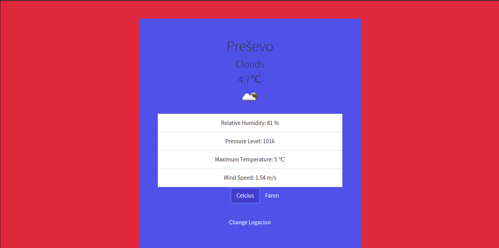

# WeatherApp

This project is part of Microverse learning and the goal of this project was to demostrate learning and implementing the project by using  uses async, await and fetch to get data from external api. This is project is a weather app where the user can check the weather of any city he likes. Also this app pulls from OpenWeatherMap API- and displays a lot more information about the weather than just the temperature. 

## Live server
<button> <a href="https://optimistic-euler-a877c4.netlify.app/"> Live demo!</a> </button>

## Built With 

- Javacript
- Bootstrap
- HTML
- CSS
- WEBPACK
- NPM
- Async, Await, Fetch api
- VS Code

## Install 

> In order to install this project please follow the next steps:

1. - [ ] Open the `Terminal`
2. - [ ] Navigate to the directory where you want to add this repository
3. - [ ] Run `git@github.com:GzimAsani/WeatherApp.git` or with HTTP`https://github.com/GzimAsani/WeatherApp.git` 
4. - [ ] Run `npm install` to install the necessary modules
5. - [ ] Go to your browser and open `dist/index.html` in the cloned repo.

## Author

👤 **Gzim Asani**
- Github: [@GzimAsani](https://github.com/GzimAsani)
- Linkedin: [GzimAsani](https://www.linkedin.com/in/gzim-asani-83390a17a/)

## 🤝 Contributing

Contributions, issues and feature requests are welcome!

Feel free to check the [issues page](https://github.com/Div685/JS-Library/issues).

## Show your support

Give a ⭐️ if you like this project!
